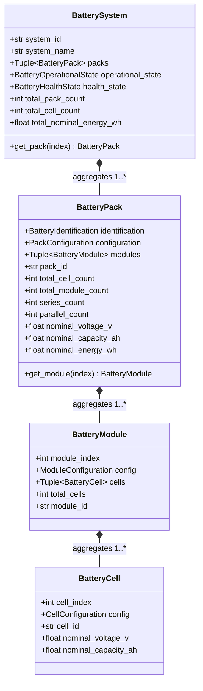
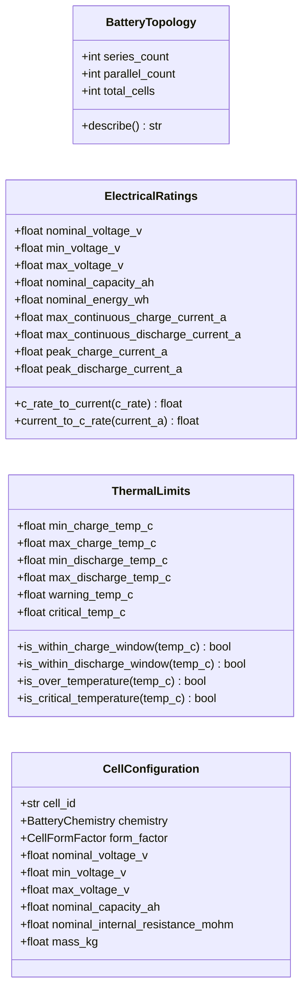

# TwinVolt — Universal Battery Domain Entities

[](#)
[](#)

---

## 1. Overview & Purpose

This document specifies the **Universal Battery Domain Entity Layer** for the **TwinVolt Universal Battery Digital Twin Platform**.

The domain layer is the pure, mathematical, and structural heart of TwinVolt. It provides generic, strongly-typed entities, immutable value objects, and physical invariant validators capable of modeling any electrochemical battery system—spanning single-cell lab testbenches to modular multi-megawatt Battery Energy Storage Systems (BESS).

---

## 2. Core Architectural Principles & Scope Boundaries

### 2.1 Purity & Independence (Golden Boundary Rule)
The domain layer is implemented in **pure Python** (standard library only) and adheres to strict isolation rules:
- **No Database Dependencies**: Zero awareness of SQL, PostgreSQL, TimescaleDB, or Redis.
- **No API / Web Dependencies**: Zero awareness of FastAPI, HTTP routes, WebSockets, or JSON/REST serialization.
- **No Hardware / Protocol Dependencies**: Zero hardcoded assumptions regarding CAN bus, MQTT, Serial/UART, or specific BMS microcontrollers (e.g., ESP32, STM32, Arduino).
- **No Solver / Modeling Coupling**: Zero direct dependency on PyBaMM, numerical ODE integrators, or machine-learning frameworks.
- **No Global Mutable State**: All value objects and entities are immutable (`frozen=True`) with pure constructor validation.

### 2.2 What is Intentionally NOT in the Domain Layer
- Raw byte decoding or network packet ingestion (handled by `src/adapters/`).
- State estimation filter algorithms like EKF/UKF (handled by `src/estimation/`).
- Dynamic differential equation solving (handled by `src/models/`).
- Database ORM mappings or query builders (handled by `src/storage/`).

---

## 3. Domain Entity & Value Object Hierarchy

The structural hierarchy forms an aggregated tree: `BatterySystem` $\rightarrow$ `BatteryPack` $\rightarrow$ `BatteryModule` $\rightarrow$ `BatteryCell`.



---

## 4. Value Objects & Configuration Contracts

Value objects represent immutable, self-validating physical parameters:



---

## 5. Physical & Logical Invariants

Every domain entity and value object enforces strict physical invariants upon instantiation:

### 5.1 Topology Invariants
- Series count $N_s \ge 1$ and parallel count $N_p \ge 1$.
- Total cell count $N_{total} = N_s \times N_p$.
- In modular packs, $\sum \text{Module Cells} = N_{total}$.

### 5.2 Electrical Rating Invariants
- $0 < V_{min} \le V_{nominal} \le V_{max}$ and $V_{min} < V_{max}$.
- Nominal capacity $C_{nom} > 0\text{ Ah}$ and nominal energy $E_{nom} > 0\text{ Wh}$.
- Continuous currents $I_{chg,max} > 0\text{ A}$, $I_{dis,max} > 0\text{ A}$.
- Peak currents satisfy $I_{peak,chg} \ge I_{cont,chg}$ and $I_{peak,dis} \ge I_{cont,dis}$.

### 5.3 Thermal Limit Invariants
- All temperatures $T > -273.15^\circ\text{C}$ (Absolute Zero).
- $T_{min,charge} < T_{max,charge}$ and $T_{min,discharge} < T_{max,discharge}$.
- $T_{min,discharge} \le T_{min,charge}$ (discharging permitted at lower ambient temperatures).
- $T_{max,charge} \le T_{max,discharge}$.
- $T_{warning} < T_{critical}$ and $T_{warning} \ge T_{max,discharge}$.

### 5.4 Identifier Invariants
- Identifiers must be non-empty strings conforming to `^[a-zA-Z0-9_-]{1,128}$`.

---

## 6. Supported Configurations & Universality

The domain layer supports diverse battery architectures purely through parametric instantiation:

| Battery Architecture | Series ($N_s$) | Parallel ($N_p$) | Typical Chemistry | Configuration Example |
| :--- | :--- | :--- | :--- | :--- |
| **Single-Cell Testbench** | 1 | 1 | NMC / LFP | Single 18650 cell evaluation |
| **Small Prototype (User Bench)** | 2 or 3 | 1 | NMC / LCO | 3S1P 11.1V prototype validation |
| **Drone / Robotics Pack** | 4 to 6 | 1 or 2 | LiPo / NMC | 6S2P 22.2V high-discharge pack |
| **Light Electric Vehicle (LEV)**| 14 to 16 | 4 to 8 | LFP / NMC | 48V 16S4P e-scooter pack |
| **Electric Vehicle Traction** | 96 to 192 | 2 to 4 | NMC / NCA | 400V / 800V modular EV pack |
| **Grid-Scale BESS** | 200+ | 10+ | LFP / Sodium-Ion | Multi-megawatt containerized BESS |

---

## 7. Package Layout

```text
src/domain/
├── __init__.py                 # Root exports of domain exceptions
├── exceptions.py               # Custom domain exception hierarchy
└── battery/
    ├── __init__.py             # Public entity and value object exports
    ├── enums.py                # BatteryChemistry, CellFormFactor, States
    ├── validation.py           # Pure invariant assertion routines
    ├── value_objects.py        # BatteryTopology, ElectricalRatings, ThermalLimits
    └── entities.py             # BatteryCell, BatteryModule, BatteryPack, BatterySystem
```
