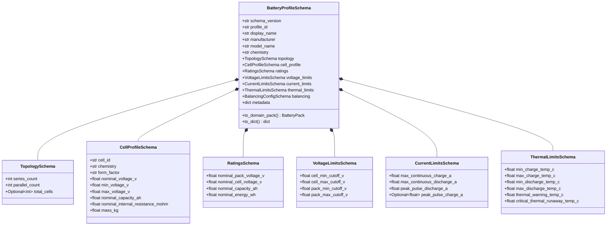

# TwinVolt — Battery Profile & Configuration Schemas

[](#)
[](#)

---

## 1. Overview & Purpose

This document specifies the **Declarative Configuration Schemas and Profile Loading Pipeline** for the **TwinVolt Universal Battery Digital Twin Platform**.

In TwinVolt, battery packs, cell chemistries, operational boundaries, and simulation models are defined declaratively in human-readable YAML or machine-generated JSON. These declarative profiles undergo strict boundary validation before being materialized into pure domain entities (`BatteryPack`, `BatterySystem`).


---

## 2. Architectural Principles & Isolation Rules

1. **Strict Separation of Concerns**: Declarative schemas represent input data contracts only. Pure domain entities (`src/domain/`) remain 100% decoupled from filesystem I/O, parsing libraries, and environment variables.
2. **Safe Deserialization**: All YAML loading strictly utilizes safe parsing (`yaml.safe_load()`). Arbitrary code execution (`eval`, `pickle`) is strictly prohibited.
3. **Explicit SI Physical Units**: All numerical fields employ mandatory SI unit suffixes (`*_v`, `*_a`, `*_ah`, `*_wh`, `*_c`, `*_mohm`, `*_ms`).
4. **Mandatory Schema Versioning**: Every profile must declare `schema_version: "1.0"`, enabling non-breaking schema evolution and migration adapters.

---

## 3. Battery Profile Schema Specification

A complete `BatteryProfileSchema` is structured into cohesive sections:



---

## 4. Reference Battery Profiles

The platform includes five standard declarative reference profiles in `config/battery_profiles/` demonstrating universality across chemistries and topologies:

| Profile File | Architecture | Chemistry | Topo | Voltage | Application |
| :--- | :--- | :--- | :--- | :--- | :--- |
| `batt_nmc_18650_1s1p.yaml` | Single Cell Testbench | NMC | 1S1P | 3.7 V | Single-cell degradation research |
| `batt_nmc_3s1p_prototype.yaml` | Hardware Prototype Bench | NMC | 3S1P | 11.1 V | Physical prototype testbench validation |
| `batt_lfp_16s1p_bess.yaml` | Stationary Energy Storage | LFP | 16S1P | 51.2 V | 48V Telecom / Solar BESS module |
| `batt_nmc_96s2p_ev.yaml` | Automotive EV Traction | NMC | 96S2P | 355.2 V | 400V 100Ah Electric Vehicle pack |
| `batt_lto_10s1p_robot.yaml` | High-Rate Robotics Pack | LTO | 10S1P | 23.0 V | 10C ultra-fast charging robot pack |

---

## 5. Model Configuration Schemas

Declarative configuration of electro-thermal models in `config/model_profiles/`:

```yaml
schema_version: "1.0"
model_configuration:
  model_id: "ecm_2rc_nmc_standard"
  paradigm: "ECM_2RC"
  description: "Dual Polarization Equivalent Circuit Model for NMC cells"
  sampling:
    simulation_step_ms: 100
    solver_type: "explicit_rk4"
  parameters:
    series_resistance_r0_mohm: 25.0
    rc1_resistance_r1_mohm: 15.0
    rc1_capacitance_c1_f: 1200.0
    rc2_resistance_r2_mohm: 10.0
    rc2_capacitance_c2_f: 4500.0
    thermal_mass_j_per_k: 45.0
    convective_heat_transfer_w_per_k: 1.2
  custom_parameters:
    coulombic_efficiency: 0.995
```

---

## 6. Programmatic Usage

```python
from src.schemas.loader import BatteryProfileLoader

# 1. Load and validate YAML profile from disk
profile_schema = BatteryProfileLoader.load_from_file("config/battery_profiles/batt_nmc_3s1p_prototype.yaml")

# 2. Materialize into verified pure Domain Entity
battery_pack = profile_schema.to_domain_pack()

print(f"Pack ID: {battery_pack.pack_id}")
print(f"Topology: {battery_pack.series_count}S{battery_pack.parallel_count}P ({battery_pack.total_cell_count} cells)")
print(f"Nominal Voltage: {battery_pack.nominal_voltage_v} V")
```
