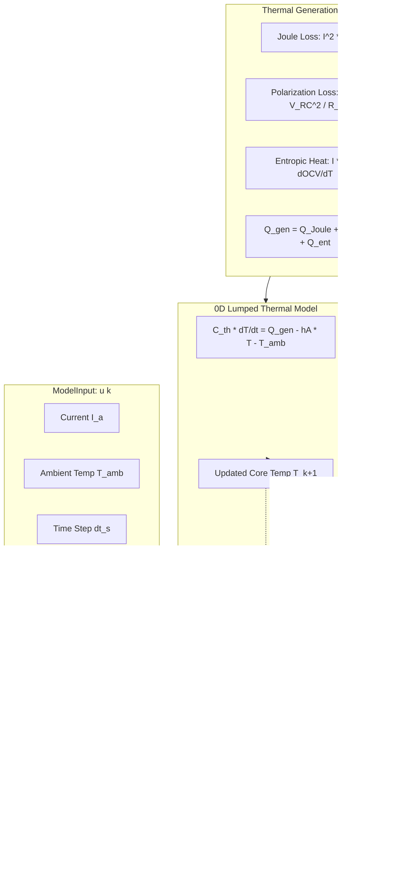

# TwinVolt — Electro-Thermal Model Specification

[](#)
[](#)

---

## 1. Purpose & Scope

This specification defines the **Electro-Thermal Equivalent Circuit Model (ECM)** architecture for the **TwinVolt Universal Battery Digital Twin Platform** (Task 2.2).

The model provides deterministic, high-speed, and physically validated simulation of battery cell dynamics:
- **Pluggable N-RC Topologies**: Parameterized support for 0-RC ($R_{int}$), 1-RC (Thevenin), 2-RC (Dual Polarization), and arbitrary $N$-RC branch configurations.
- **Analytical Discrete-Time Integration**: Exact exponential decay solutions for polarization overpotentials and thermal dissipation, eliminating numerical drift and time-step instability.
- **0D Lumped Thermal Coupling**: Direct coupling of electrical dissipation (Joule heating, polarization losses, reversible entropic heat) to core temperature evolution.
- **Strict Chemistry Neutrality**: Mathematical formulations operate on abstract physical parameters ($\boldsymbol{\theta}$) without hardcoded chemistry constants.



---

## 2. Electrical ECM Mathematical Formulation

### 2.1 Terminal Voltage Equation

$$V_{term}[k] = V_{oc}\left(\text{SOC}[k+1], T[k]\right) - I[k] \cdot R_0 - \sum_{i=1}^N V_{RC,i}[k+1] - V_{hysteresis}$$

Where:
- $V_{oc}$: Open-Circuit Voltage as a function of State of Charge ($\text{SOC}$) and temperature ($T$).
- $I[k]$: Load current in Amperes ($I > 0$ discharge, $I < 0$ charge).
- $R_0$: Series ohmic resistance in Ohms ($\Omega$).
- $V_{RC,i}$: Polarization overpotential across the $i$-th RC branch in Volts.
- $V_{hysteresis}$: Dynamic hysteresis overpotential in Volts.

### 2.2 Discrete Polarization State Evolution

The continuous ODE governing the $i$-th RC branch is:

$$\frac{d V_{RC,i}}{dt} = \frac{I(t)}{C_i} - \frac{V_{RC,i}(t)}{R_i C_i}$$

Assuming constant current $I[k]$ over the time step $\Delta t$, the **exact discrete analytical solution** is:

$$V_{RC,i}[k+1] = V_{RC,i}[k] \cdot e^{-\Delta t / \tau_i} + I[k] \cdot R_i \left(1 - e^{-\Delta t / \tau_i}\right)$$

Where $\tau_i = R_i \cdot C_i$ is the polarization time constant in seconds.

### 2.3 State of Charge (Coulomb Counting) Evolution

$$\text{SOC}[k+1] = \text{SOC}[k] - \frac{I[k] \cdot \Delta t \cdot \eta(I[k])}{Q_{nom} \times 3600}$$

Where $\eta(I) = \text{Coulombic Efficiency}$ during charging ($I < 0$), and $\eta(I) = 1.0$ during discharging ($I \ge 0$).

---

## 3. Lumped 0D Thermal Formulation

The 0D lumped thermal dynamics model is governed by the energy balance:

$$C_{th} \frac{dT}{dt} = \dot{Q}_{gen} - \dot{Q}_{loss} = \dot{Q}_{gen} - hA \left(T(t) - T_{amb}\right)$$

Where:
- $C_{th} = m \cdot C_p$: Lumped thermal capacitance in $\text{J/K}$.
- $hA = \frac{1}{R_{th}}$: Convective heat transfer coefficient in $\text{W/K}$.
- $R_{th}$: Thermal resistance to ambient in $\text{K/W}$.

### Exact Discrete-Time Thermal Solution:

$$T[k+1] = T_{amb} + \left(T[k] - T_{amb}\right) e^{-\Delta t / \tau_{th}} + \dot{Q}_{gen} \cdot R_{th} \left(1 - e^{-\Delta t / \tau_{th}}\right)$$

Where $\tau_{th} = R_{th} C_{th} = \frac{C_{th}}{hA}$ is the thermal time constant in seconds.

---

## 4. Electro-Thermal Loss Coupling

Total instantaneous thermal generation rate $\dot{Q}_{gen}$ (in Watts) is composed of three physical mechanisms:

$$\dot{Q}_{gen} = \max\left(0.0, \; \dot{Q}_{Joule} + \dot{Q}_{polarization} + \dot{Q}_{entropic}\right)$$

1. **Joule Ohmic Heating**:
   $$\dot{Q}_{Joule} = I^2 \cdot R_0$$
2. **Polarization Dynamic Losses**:
   $$\dot{Q}_{polarization} = \sum_{i=1}^N \frac{V_{RC,i}^2}{R_i}$$
3. **Reversible Entropic Reaction Heat**:
   $$\dot{Q}_{entropic} = I \cdot \left(T_{core} + 273.15\right) \cdot \frac{\partial V_{oc}}{\partial T}$$

---

## 5. Supported ECM Model Configurations

| Model Topology | Paradigm | Branches ($N$) | Primary Dynamic Phenomena |
| :--- | :--- | :--- | :--- |
| **0-RC ($R_{int}$)** | `ECM_0RC` | $0$ | Instantaneous ohmic drop ($V = V_{oc} - I R_0$). |
| **1-RC (Thevenin)** | `ECM_1RC` | $1$ | Ohmic drop + dominant electrochemical charge-transfer polarization. |
| **2-RC (Dual Polarization)** | `ECM_2RC` | $2$ | Fast charge-transfer ($\tau_1 \approx 1\text{–}10\text{s}$) + slow solid-state diffusion ($\tau_2 \approx 30\text{–}200\text{s}$). |
| **N-RC (Generic)** | `ECM_NRC` | $N$ | High-order empirical relaxation fitting. |

---

## 6. Programmatic Usage Example

```python
from src.models.ecm.generic_ecm import GenericECMModel
from src.models.types import ModelInput

# 1. Instantiate standard 2-RC Dual Polarization model
model = GenericECMModel.create_dual_polarization_2rc_model(
    model_id="cell_dp_2rc",
    nominal_capacity_ah=2.2,
    nominal_voltage_v=3.7,
    r0_ohm=0.025,
    r1_ohm=0.015,
    c1_farad=1200.0,
    r2_ohm=0.010,
    c2_farad=4500.0,
)

# 2. Initialize state at 90% SOC, 25°C
model.initialize(soc_init=0.9, temperature_c=25.0)

# 3. Simulate 5.0 A discharge step for dt = 1.0 s
output = model.step(ModelInput(current_a=5.0, dt_s=1.0, ambient_temperature_c=25.0))

print(f"Terminal Voltage: {output.terminal_voltage_v:.4f} V")
print(f"Heat Generation:  {output.heat_generation_w:.4f} W")
print(f"Updated Core T:   {output.state.temperature_c:.2f} °C")
```
