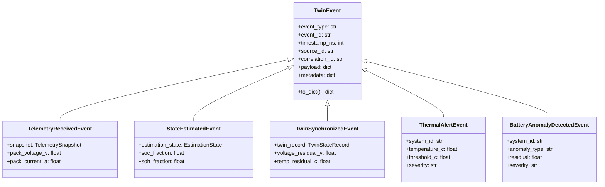

# Internal Event Bus & Observability Specification

[](#)
[](#)

---

## 1. Overview & Purpose

The **Internal Event Bus & Observability Subsystem** provides a thread-safe, in-process publish-subscribe notification architecture for broadcasting lifecycle changes, telemetry observations, state updates, safety alerts, and physical anomalies within the TwinVolt platform.

### Core Objectives
1. **Decoupled Architecture**: Enables runtime components (ingestion, digital twin state coordinators, anomaly detectors) to broadcast state transitions without tight coupling.
2. **Zero Physics Pollution**: The mathematical core (`src/models/`) and state estimators (`src/estimators/`) remain completely independent of the event bus.
3. **Fault Isolation**: Misbehaving or failing subscriber handlers are captured and isolated; a single subscriber exception will never crash event publication or abort remaining subscribers.
4. **Deterministic Invocation**: Handlers execute in deterministic priority order (`priority: int`), sorted by `(priority, registration_sequence)`.
5. **Integrated Observability**: Tracks throughput counters, execution durations (latency min/max/avg), and failure rates with thread safety.

---

## 2. Event Hierarchy



---

## 3. EventBus Contract & Wildcard Routing

### 3.1 Topic Matching Rules
- **Exact Match**: e.g., `"telemetry.received"` matches only `"telemetry.received"`.
- **Wildcard All**: `"*"` matches all published events.
- **Prefix Glob Patterns**: e.g., `"alert.*"` matches `"alert.thermal"` and `"alert.overvoltage"`.

### 3.2 Error Isolation
```text
Event Published -> Match Subscribers -> [Priority Sort]
                                            │
                                            ├──> Handler 1 (Success) -> Record Latency
                                            ├──> Handler 2 (Raises Error) -> Log Failure -> Continue
                                            └──> Handler 3 (Success) -> Record Latency
```

---

## 4. Current Implementations

| Implementation | Characteristics | Use Case |
| :--- | :--- | :--- |
| [`DigitalTwinEventBus`](file:///c:/College%20Stuff/TwinVolt-%20Battery%20Digital%20Twin/src/events/bus.py#L32) | Thread-safe in-process event broker with priority ordering and metrics. | Core runtime engine, alerts, observability. |
| [`ObservabilityMetrics`](file:///c:/College%20Stuff/TwinVolt-%20Battery%20Digital%20Twin/src/events/observability.py#L18) | In-process counters, failure tracker, execution duration percentiles. | Diagnostics, performance auditing, health monitoring. |
| [`DiagnosticAuditLogger`](file:///c:/College%20Stuff/TwinVolt-%20Battery%20Digital%20Twin/src/events/observability.py#L85) | Ring-buffer in-memory audit log observer. | Debugging, historical event tracing. |
