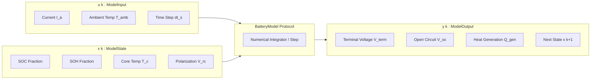

# TwinVolt — Mathematical Core & Model Contracts Specification

[](#)
[](#)

---

## 1. Purpose & Scope

This specification defines the **Mathematical Core, State Space Abstractions, and Model Contracts** for the **TwinVolt Universal Battery Digital Twin Platform** (Task 2.1).

In TwinVolt, mathematical battery models (Equivalent Circuit Models, physics-based electrochemical solvers, thermal models, and state estimators) interact with the simulation runtime through strongly-typed, immutable protocols. This ensures:
- **Pluggability**: Simulation engines and observers interact strictly through abstract protocols (`BatteryModel`, `StateEstimator`).
- **Chemistry & Scale Neutrality**: Mathematical equations accept physical parameters ($\theta$) at runtime without hardcoded chemistry constants.
- **Dimensional Correctness & SI Units**: All quantities use explicit SI unit suffixes (`*_v`, `*_a`, `*_w`, `*_c`, `*_mohm`, `*_f`, `*_s`, `*_ns`).
- **Physical Invariant Defense**: Guarantees bounded, finite, and physically plausible state evolutions.



---

## 2. State-Space Mathematical Formulation

A discrete-time battery simulation step is formalized as:

$$\mathbf{x}[k+1] = f\left(\mathbf{x}[k], \mathbf{u}[k], \boldsymbol{\theta}, \Delta t\right)$$

$$\mathbf{y}[k] = g\left(\mathbf{x}[k], \mathbf{u}[k], \boldsymbol{\theta}\right)$$

Where:
- $\mathbf{x}[k]$ is the **State Vector** (`ModelState`): $[\text{SOC}, \text{SOH}, T_{core}, V_{RC,1}, V_{RC,2}, \dots]^T$
- $\mathbf{u}[k]$ is the **Input Vector** (`ModelInput`): $[I, T_{amb}, T_{coolant}, \dots]^T$
- $\mathbf{y}[k]$ is the **Output Vector** (`ModelOutput`): $[V_{term}, V_{oc}, Q_{gen}, R_{int}, \dots]^T$
- $\boldsymbol{\theta}$ is the **Parameter Container** (`ModelParameters`): $[Q_{nom}, V_{nom}, m, C_p, hA, \dots]^T$
- $\Delta t$ is the **Time Step Duration** in seconds ($dt > 0$).

---

## 3. Core Protocol Contracts

### 3.1 `BatteryModel` Protocol

```python
from typing import Any, Optional, Protocol, runtime_checkable

@runtime_checkable
class BatteryModel(Protocol):
    """Universal Protocol governing all battery simulation models."""

    @property
    def metadata(self) -> ModelMetadata: ...

    @property
    def state(self) -> ModelState: ...

    @property
    def parameters(self) -> ModelParameters: ...

    def initialize(
        self,
        soc_init: float = 1.0,
        temperature_c: float = 25.0,
        **kwargs: Any,
    ) -> ModelState: ...

    def step(
        self,
        model_input: ModelInput,
        state: Optional[ModelState] = None,
    ) -> ModelOutput: ...

    def reset(self, initial_state: Optional[ModelState] = None) -> None: ...
```

### 3.2 Auxiliary Model Protocols

- **`OCVModel` Protocol**: $V_{oc} = f(\text{SOC}, T)$ with derivatives $\frac{dOCV}{dSOC}$ and $\frac{dOCV}{dT}$.
- **`ThermalModel` Protocol**: Discrete temperature progression $\Delta T = f(Q_{gen}, T_{amb}, T_{current}, dt)$.
- **`NumericalIntegrator` Protocol**: Scalar ODE stepping interface ($dy/dt = f(t, y)$).

---

## 4. State Vectors & Physical Containers

| Type | Immutability | Core Fields | Physical Invariants |
| :--- | :--- | :--- | :--- |
| `ModelState` | Frozen Dataclass | `soc_fraction`<br/>`soh_fraction`<br/>`temperature_c`<br/>`polarization_voltages_v`<br/>`hysteresis_voltage_v`<br/>`custom_states` | $0.0 \le \text{SOC} \le 1.0$<br/>$0.0 \le \text{SOH} \le 1.0$<br/>$T > -273.15^\circ\text{C}$<br/>All floats finite (no NaN/Inf) |
| `ModelInput` | Frozen Dataclass | `current_a`<br/>`dt_s`<br/>`ambient_temperature_c`<br/>`coolant_temperature_c`<br/>`coolant_flow_rate_m3_per_s` | $\Delta t > 0.0\text{ s}$<br/>$T_{amb} > -273.15^\circ\text{C}$<br/>All floats finite |
| `ModelOutput` | Frozen Dataclass | `terminal_voltage_v`<br/>`open_circuit_voltage_v`<br/>`state`<br/>`heat_generation_w`<br/>`internal_resistance_mohm` | $Q_{gen} \ge 0.0\text{ W}$<br/>$R_{int} \ge 0.0\text{ m}\Omega$<br/>All floats finite |
| `ModelParameters` | Frozen Dataclass | `nominal_capacity_ah`<br/>`nominal_voltage_v`<br/>`cell_mass_kg`<br/>`specific_heat_capacity_j_per_kg_k`<br/>`convective_heat_transfer_w_per_k` | $Q_{nom} > 0.0\text{ Ah}$<br/>$V_{nom} > 0.0\text{ V}$<br/>$m > 0.0\text{ kg}$<br/>$C_p > 0.0\text{ J/(kg}\cdot\text{K)}$ |

---

## 5. Numerical Solvers & Math Utilities

The package provides deterministic mathematical tools in `src/models/math.py`:

1. **Coulomb Counting Step**:
   $$\Delta \text{SOC} = -\frac{I \cdot \Delta t \cdot \eta}{Q_{nom} \times 3600}$$
   *(where $\eta = \text{Coulombic Efficiency}$ during charging, $\eta = 1.0$ during discharge)*.

2. **Analytical 1-RC Branch Voltage Step**:
   $$V_{RC}[k+1] = V_{RC}[k] \cdot e^{-\Delta t / \tau} + I R \left(1 - e^{-\Delta t / \tau}\right) \quad \text{where } \tau = R C$$

3. **Explicit ODE Integrators**:
   - `ExplicitEulerIntegrator`: $y_{k+1} = y_k + \Delta t \cdot f(t_k, y_k)$
   - `RungeKutta4Integrator` (RK4): Classical 4th-order Runge-Kutta integrator with sub-millisecond evaluation speed.

---

## 6. Prohibited Couplings & Golden Boundaries

1. **Zero Hardware Coupling**: Mathematical models contain no references to microcontrollers, ADCs, pinouts, or communication buses.
2. **Zero Ingestion Coupling**: Models evaluate on pure inputs (`ModelInput`) and do not perform socket I/O, MQTT parsing, or HTTP calls.
3. **Zero Database Coupling**: State vectors are pure in-memory data structures.
