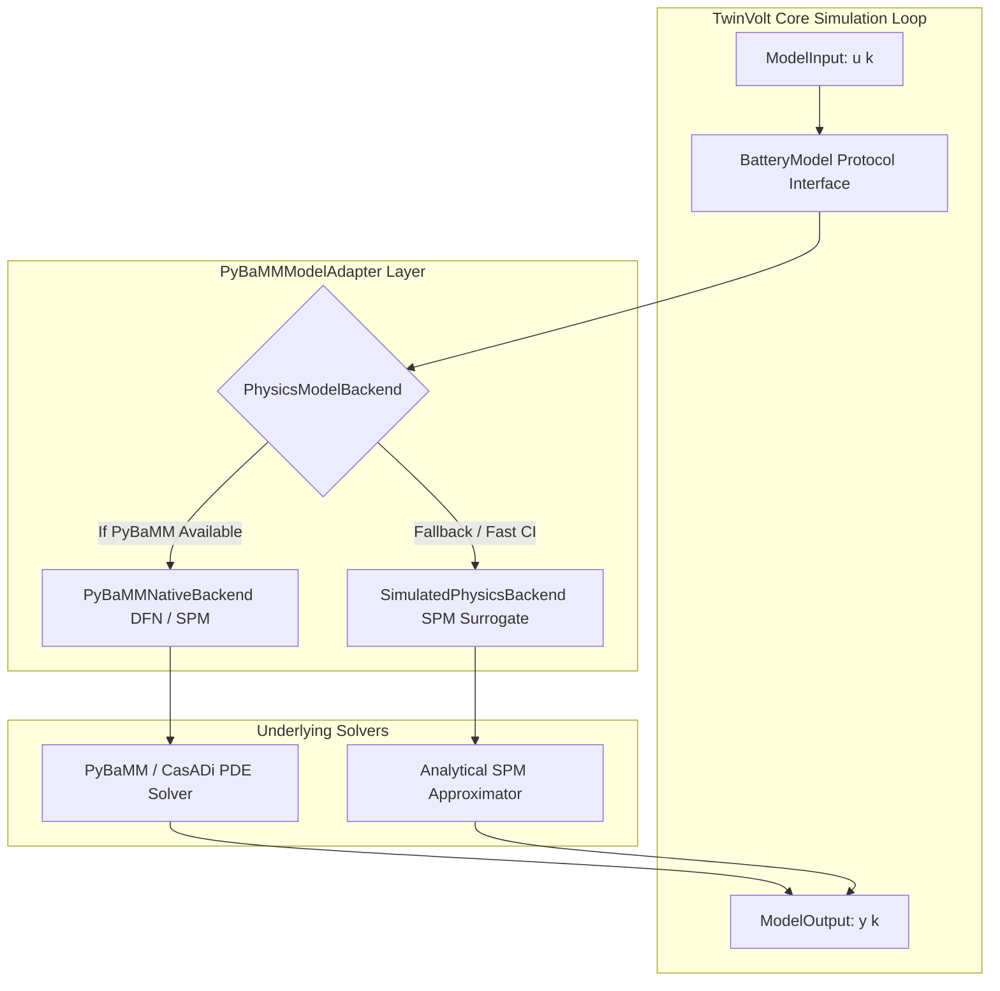

# TwinVolt — Physics-Based Model Backend & PyBaMM Adapter Specification

[](#)
[](#)

---

## 1. Purpose & Architectural Scope

This specification defines the **Physics-Based Electrochemical Model Backend and PyBaMM Adapter** architecture for the **TwinVolt Universal Battery Digital Twin Platform** (Task 2.3).

High-fidelity partial differential equation (PDE) electrochemical solvers (such as the Doyle-Fuller-Newman model and Single Particle Model) are essential for deep internal state observation (e.g., solid-phase lithium concentration gradients, electrolyte depletion, and localized reaction overpotentials).

TwinVolt achieves complete architectural decoupling by wrapping electrochemical solvers behind the universal `BatteryModel` protocol from Task 2.1:
- **Solver Agnostic**: The Digital Twin runtime, telemetry stream, and observer layers interact with physics models through identical `initialize()`, `step()`, and `reset()` interfaces as Equivalent Circuit Models.
- **Graceful Fallback**: In minimal or CI environments where full CasADi/C-compilers are not present, an analytical `SimulatedPhysicsBackend` provides sub-millisecond execution.
- **Microscopic State Mapping**: Internal electrochemical states (surface concentrations $c_s$, reaction overpotentials $\eta_{rxn}$) are mapped to `ModelState.custom_states` without altering standard domain contracts.



---

## 2. Supported Electrochemical Solvers

| Paradigm | Model Type | Spatial Domains | Governing Physics |
| :--- | :--- | :--- | :--- |
| `PHYSICS_PYBAMM_SPM` | Single Particle Model (SPM) | Particle radial ($r$) | Fickian diffusion in spherical active material particles; Butler-Volmer kinetics. Neglects electrolyte gradients. |
| `PHYSICS_PYBAMM_SPME` | SPM with Electrolyte (SPMe) | Radial ($r$) + Through-cell ($x$) | SPM physics + 1D leading-order polynomial electrolyte concentration and potential variations. |
| `PHYSICS_PYBAMM_DFN` | Doyle-Fuller-Newman (P2D / DFN) | Radial ($r$) + Through-cell ($x$) | Coupled non-linear PDEs for solid-phase diffusion, liquid electrolyte diffusion, Butler-Volmer interfacial charge transfer, and Ohm's law in porous electrodes. |

---

## 3. Parameter Mapping & Sets

The platform integrates standard empirical electrochemical parameter datasets:
- **`Chen2020`**: High-energy LG M50 21700 NMC811/Graphite-Silicon cell.
- **`Marquis2019`**: Standard NMC622/Graphite cell.
- **`Prada2013`**: High-rate A123 26650 Lithium Iron Phosphate ($\text{LiFePO}_4$ / LFP) cell.
- **`Ecker2015`**: Kokam 7.5 Ah High-Power NMC cell.

---

## 4. Internal State Space Mapping

PyBaMM microscopic continuum variables are mapped to the standard `ModelState`:

```python
ModelState(
    soc_fraction=0.85,
    temperature_c=25.4,
    polarization_voltages_v=(0.012,),
    custom_states={
        "c_s_pos_surface": 24150.0,   # Positive particle surface Li concentration (mol/m^3)
        "c_s_neg_surface": 28400.0,   # Negative particle surface Li concentration (mol/m^3)
        "eta_reaction_v": 0.0084,     # Butler-Volmer reaction overpotential (V)
        "eta_ohmic_v": 0.0250,        # Bulk electrolyte + matrix ohmic drop (V)
    }
)
```

---

## 5. Model Hot-Swappability Example

```python
from src.models.base import BatteryModel
from src.models.ecm.generic_ecm import GenericECMModel
from src.models.physics.pybamm_adapter import PyBaMMModelAdapter
from src.models.types import ModelInput

# Hot-swap between ECM 2-RC and Physics DFN in identical simulation harness
models: list[BatteryModel] = [
    GenericECMModel.create_dual_polarization_2rc_model("ecm_dp", 2.2, 3.7),
    PyBaMMModelAdapter.create_spm_adapter("pybamm_spm", 2.2, 3.7, parameter_set_name="Chen2020"),
]

inp = ModelInput(current_a=3.0, dt_s=1.0, ambient_temperature_c=25.0)

for m in models:
    m.initialize(soc_init=0.9, temperature_c=25.0)
    out = m.step(inp)
    print(f"[{m.metadata.paradigm}] V_term: {out.terminal_voltage_v:.4f}V | SOC: {out.state.soc_fraction:.4f}")
```
