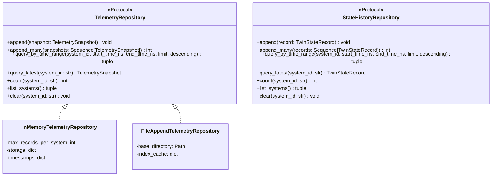

# Time-Series Persistence & Storage Repository Specification

---

## 1. Overview & Purpose

The **Time-Series Persistence and Storage Subsystem** provides a protocol-oriented, database-neutral interface for appending, indexing, querying, and retaining high-frequency battery telemetry snapshots and co-simulated Digital Twin state records.

### Core Objectives
1. **Database Decoupling**: Isolate domain entities and physics simulation models from concrete storage technologies (e.g. TimescaleDB, PostgreSQL, SQLite, InfluxDB, Parquet, or JSON-Lines).
2. **Sub-Millisecond Query Performance**: Provide $O(\log N + K)$ logarithmic range queries for time-series intervals.
3. **Bounded In-Memory Buffering**: Provide deterministic FIFO circular memory repositories for live runtime monitoring, unit testing, and simulation replays without unbounded memory growth.
4. **Timezone Awareness & Monotonicity**: Handle timezone-aware timestamps with integer nanosecond precision since UNIX epoch.

---

## 2. Storage Repository Protocols

---

## 3. Query Semantics & Boundary Rules

### 3.1 Time Interval Validation
Query intervals $[t_{start}, t_{end}]$ strictly enforce:
1. $t_{start} \ge 0$ and $t_{end} \ge 0$.
2. $t_{start} \le t_{end}$ (violating this raises [`InvalidTimeRangeError`](file:///c:/College%20Stuff/TwinVolt-%20Battery%20Digital%20Twin/src/storage/exceptions.py#L28)).
3. Empty results return an empty tuple `()` without throwing exceptions.

### 3.2 Timezone Handling
- Timestamps are stored as integer nanoseconds since UNIX epoch (`timestamp_ns: int`).
- Timezone conversions are facilitated via [`datetime_to_timestamp_ns`](file:///c:/College%20Stuff/TwinVolt-%20Battery%20Digital%20Twin/src/storage/base.py#L22) and [`timestamp_ns_to_datetime`](file:///c:/College%20Stuff/TwinVolt-%20Battery%20Digital%20Twin/src/storage/base.py#L46). Naive datetime inputs default to UTC.

### 3.3 Multi-System Isolation
Queries targeting `system_id = "pack_A"` return solely records associated with `pack_A`, maintaining absolute data isolation across multiple concurrent battery systems.

---

## 4. Current Implementations

| Implementation | Primary Use Case | Time Complexity (Append / Range Query) | Eviction Policy |
| :--- | :--- | :---: | :--- |
| [`InMemoryTelemetryRepository`](file:///c:/College%20Stuff/TwinVolt-%20Battery%20Digital%20Twin/src/storage/memory_repository.py#L20) | Real-time state engine, live observation, unit testing, HIL benchmarks. | $O(1)$ amortized / $O(\log N + K)$ | Bounded FIFO eviction when `len > max_records_per_system`. |
| [`FileAppendTelemetryRepository`](file:///c:/College%20Stuff/TwinVolt-%20Battery%20Digital%20Twin/src/storage/file_repository.py#L22) | Local development logging, offline replay storage, audit trail. | $O(1)$ append / $O(\log N + K)$ indexed read | Append-only files. |
