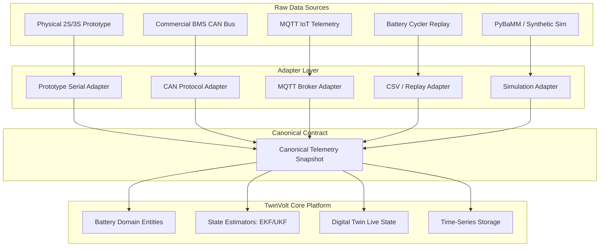
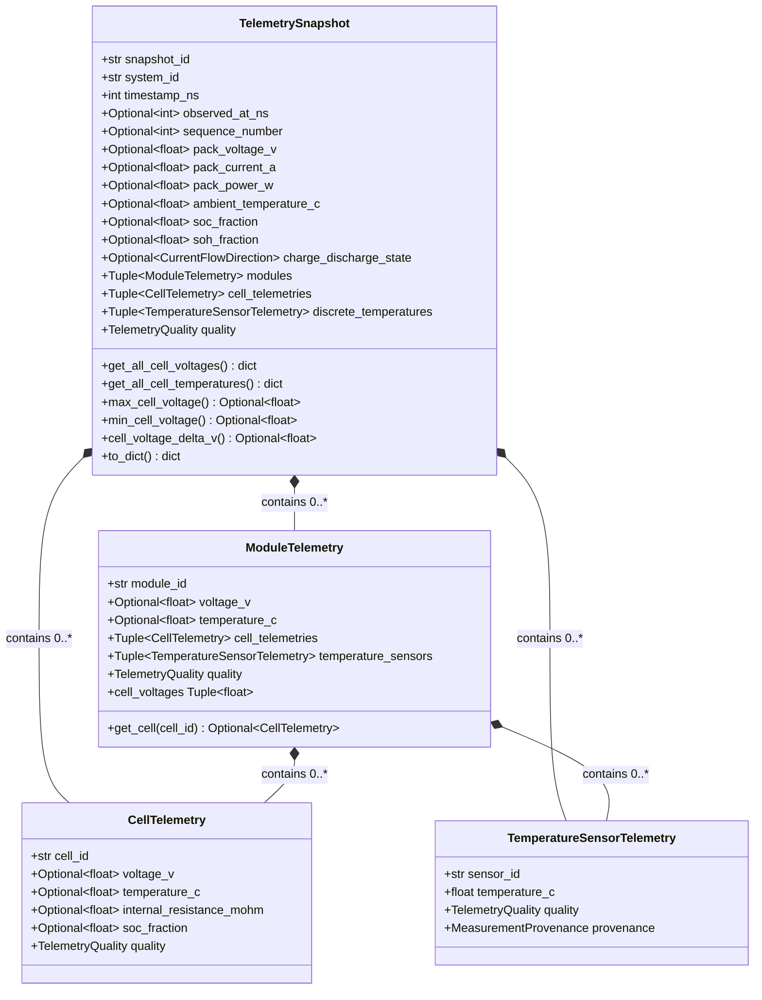

# TwinVolt — Canonical Telemetry Model

[](#)
[](#)

---

## 1. Overview & Purpose

> [!IMPORTANT]
> **Canonical Telemetry is an internal platform contract, NOT a hardware protocol.**

The **Canonical Telemetry Model** defines the universal, strongly-typed internal representation of battery measurements, physical observations, and runtime state inside the **TwinVolt Universal Battery Digital Twin Platform**.

Physical battery hardware, BMS controllers, CAN buses, MQTT brokers, lab cyclers, and simulation engines all produce heterogeneous, protocol-specific telemetry payloads. In TwinVolt, **future adapters** are responsible for ingesting and decoding those raw streams, converting units, and normalizing them into a single, standardized **Canonical Telemetry Snapshot**.



---

## 2. Core Telemetry Architecture & Principles

### 2.1 Explicit Units (Standard SI)
Every measurement field in the canonical contract follows strict SI unit naming conventions:
- **Voltage**: Volts (`*_v`)
- **Current**: Amperes (`*_a`) — Positive (+) for Discharging, Negative (−) for Charging
- **Power**: Watts (`*_w`)
- **Temperature**: Degrees Celsius (`*_c`)
- **Capacity**: Ampere-hours (`*_ah`)
- **Energy**: Watt-hours (`*_wh`)
- **Resistance**: Milliohms (`*_mohm`)
- **Time**: Nanoseconds (`*_ns`)

### 2.2 Strict Optionality & Absence Semantics (Missing != Zero)
Battery telemetry sources vary widely in sensor richness:
- A simple sensor board may report only **Pack Voltage** and **Pack Current**.
- An automotive BMS may report **192 cell voltages**, **32 temperature probes**, **SOC**, **SOH**, and **diagnostic error codes**.

The Canonical Telemetry Model explicitly models optionality using `Optional[float] = None`:
> [!CAUTION]
> **Missing data is NEVER silently replaced with zero.**
> - Missing Current $\ne 0.0\text{ A}$ (0.0 A implies an idle, zero-load state).
> - Missing Temperature $\ne 0.0^\circ\text{C}$ (0.0°C implies ice/freezing conditions).
> - Missing SOC $\ne 0.0\%$ (0.0% implies a completely depleted cell).

---

## 3. Telemetry Hierarchy & Snapshot Model

A single `TelemetrySnapshot` captures a temporally coherent observation of a battery pack or multi-module assembly:



---

## 4. Time Semantics & Clock Precision

### 4.1 Nanosecond Epoch Strategy
- `timestamp_ns`: Measurement time at the physical sensor / BMS source in **integer nanoseconds since UNIX epoch** (`1970-01-01T00:00:00Z`).
- `observed_at_ns`: Optional ingestion time recorded by the host receiving adapter upon network arrival.
- **Why integer nanoseconds?** Floating-point seconds lose sub-millisecond precision over decades of epoch time. Integer nanoseconds provide exact, deterministic, lossless timestamps compatible with TimescaleDB, InfluxDB, and Parquet.

---

## 5. Telemetry Quality & Provenance Flags

To support safety-critical digital twin state estimation, every measurement carries explicit quality and provenance flags:

| Quality Flag | Definition | Action in Twin Core |
| :--- | :--- | :--- |
| `VALID` | Sensor reading verified, physically plausible, and fresh. | Fed directly to state estimation filters (EKF/UKF). |
| `DEGRADED` | Measurement available, but higher noise/jitter detected. | Fed to filters with increased measurement covariance ($R$). |
| `INVALID` | Corrupted packet, CRC error, or unphysical spike. | Discarded; previous state projected forward. |
| `UNAVAILABLE` | Sensor is offline or not installed in this hardware configuration. | Skipped without raising errors. |
| `STALE` | Sensor timestamp exceeds expected packet interval window. | Flagged; warning emitted to health monitor. |

| Provenance Flag | Definition |
| :--- | :--- |
| `MEASURED` | Direct hardware ADC / physical sensor observation. |
| `ESTIMATED` | Algorithmic estimation produced by a state observer / Kalman filter. |
| `SYNTHETIC` | Generated from a mathematical battery model or synthetic drive cycle. |
| `DERIVED` | Calculated algebraically from other raw measurements (e.g. $P = V \times I$). |

---

## 6. Supported Configurations & Addressing

The canonical model supports explicit identifier-based addressing rather than fragile positional arrays:

```python
# Direct Cell Telemetry (e.g. 3S1P Prototype Bench)
cells = (
    CellTelemetry(cell_id="cell_0", voltage_v=3.71, temperature_c=25.2),
    CellTelemetry(cell_id="cell_1", voltage_v=3.70, temperature_c=25.1),
    CellTelemetry(cell_id="cell_2", voltage_v=3.69, temperature_c=25.0),
)

snapshot = TelemetrySnapshot(
    snapshot_id="snap_1001",
    system_id="prototype_3s1p",
    timestamp_ns=1700000000000000000,
    pack_voltage_v=11.10,
    pack_current_a=2.0,
    charge_discharge_state=CurrentFlowDirection.DISCHARGING,
    cell_telemetries=cells,
)

# Automated Voltage Imbalance & Metric Queries
delta_v = snapshot.cell_voltage_delta_v()  # 0.02 V
v_max = snapshot.max_cell_voltage()        # 3.71 V
v_min = snapshot.min_cell_voltage()        # 3.69 V
```

---

## 7. Deterministic Serialization

The `TelemetrySnapshot.to_dict()` method exports primitive Python types (`dict`, `list`, `float`, `int`, `str`, `None`) directly serializable to:
- **JSON REST / WebSocket Payloads**
- **MQTT Telemetry Topics**
- **TimescaleDB / PostgreSQL Relational Records**
- **Parquet / Arrow Analytics Files**
